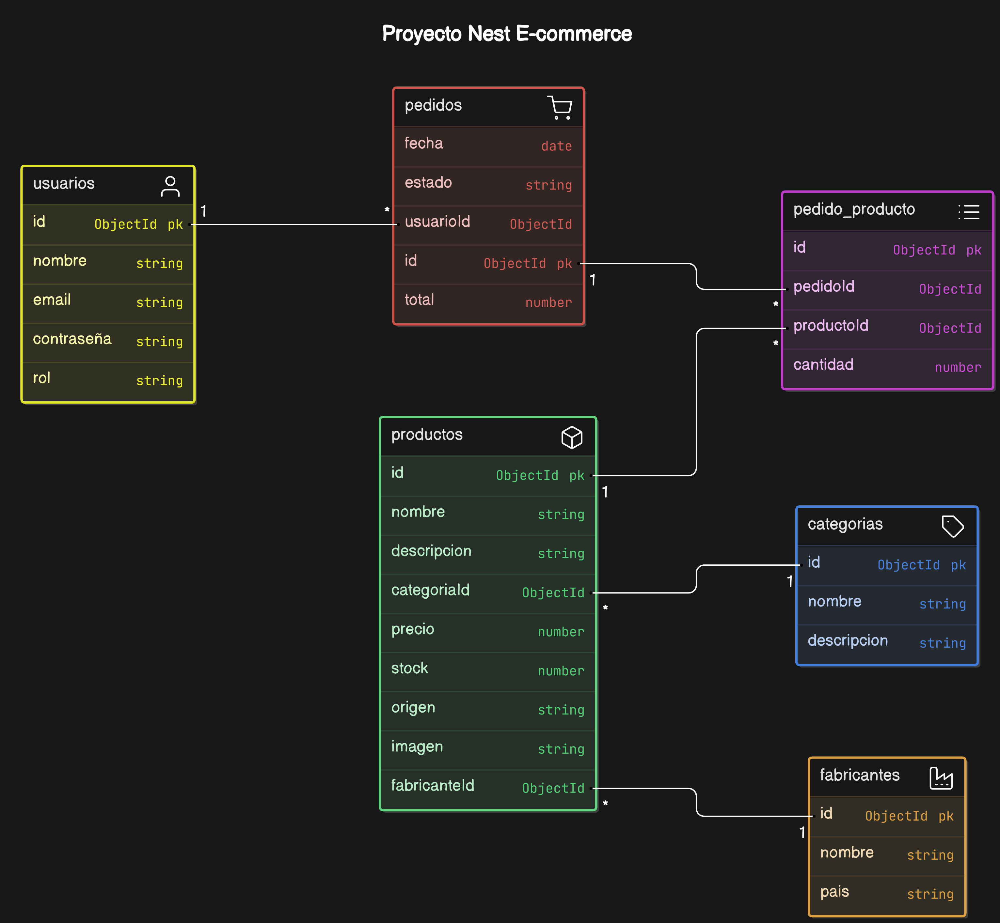

# Proyecto Nest (API REST de Ecommerce)

## Objetivo
Desarrollar una aplicación que gestione diferentes entidades de un e-commerce a través de sus respectivos controladores.

## Componentes principales

### Controladores
- Clases responsables de manejar solicitudes HTTP entrantes y devolver respuestas.
- Asociados a rutas específicas del sistema de enrutamiento de NestJS.
- Modularizados y reutilizables.

### Servicios
- Clases que encapsulan la lógica de negocio.
- Utilizan el principio de inyección de dependencias.
- Contienen métodos para interactuar con bases de datos y realizar llamadas a APIs.

### Entidades
- Clases que definen los atributos y comportamientos de objetos específicos.

### DTOs (Data Transfer Objects)
- Máscaras para filtrar entradas de datos.
- Validan la estructura y tipos de datos recibidos desde el cliente.
- Protegen la API contra solicitudes malformadas o maliciosas.

## Entidades Principales de los Módulos de la Aplicación

### Módulo Principal
- Controlador y Servicio

### Operadores
- Controladores, DTOs, Entidades y Servicios de Compradores, Operadores y Pedidos.

### Productos
- Controladores, DTOs, Entidades y Servicios de Productos, Categorías y Fabricantes.

### Relaciones y Seguridad
- La aplicación es una API de los distintos endpoints y relaciones con NestJS, MongoDB y Mongoose del lado del servidor.
- Contiene Guards, JWT, Bcrypt y Passport para la seguridad.
- Se realizan pruebas a los diferentes endpoints de la API utilizando Postman para garantizar el correcto funcionamiento.

## Ramas del Proyecto
- Una rama contiene la versión con bases de datos relacionales utilizando Docker, PostgreSQL y pgAdmin.
- La otra rama contiene la versión utilizando MongoDB y Mongoose.

### Entities

#### Usuario
- ID: ObjectId
- Nombre: String
- Email: String
- Contraseña: String
- Rol: String

#### Producto
- ID: ObjectId
- Nombre: String
- Descripción: String
- Precio: Number
- Stock: Number
- Origen: String
- Imagen: String

#### Categoría
- ID: ObjectId
- Nombre: String
- Descripción: String

#### Fabricante
- ID: ObjectId
- Nombre: String
- País: String

#### Pedido
- ID: ObjectId
- Fecha: Date
- Estado: String
- UsuarioID: ObjectId (Referencia)
- Total: Number

#### PedidoProducto
- ID: ObjectId
- PedidoID: ObjectId (Referencia)
- ProductoID: ObjectId (Referencia)
- Cantidad: Number

### Relaciónes
- Un **Usuario** puede realizar muchos **Pedidos**.
- Un **Pedido** puede tener muchos **Productos** a través de **PedidoProducto**.
- Un **Producto** puede pertenecer a una **Categoría**.
- Un **Producto** puede tener un **Fabricante**.

### Segugirdad
- Utiliza **JWT** para la autenticación de usuarios.
- Usa **Bcrypt** para el hashing de contraseñas.
- Implementar **Guards** y **Passport** para proteger las rutas y asegurar que solo los usuarios autenticados puedan acceder a ciertos recursos.

## Documentación 
- Documentación de toda la API y los endpoints con Swagger.

## Testing 
- Se realizan todas las pruebas unitarias con Jest en todos los módulos de la aplicación.

## Diagrama de Entidad-Relación

